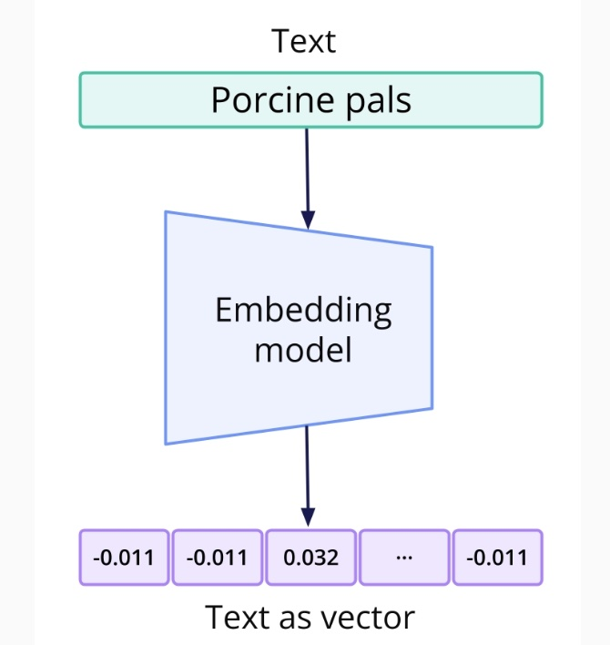

1-Intro

1. [What Are LLMs and What Is the Gemini API](#schema1)
2. [LLM Architecture at a High Level](#schema2)
3. [LLMs vs. Traditional ML Models](#schema3)
4. [LLM Tasks](#schema4)
5. [Gemini Models](#schema5)
6. [Appendix: Gemini Performance on Benchmarks](#shcema6)
7. [Doc](#schemadoc)

## 1. What Are LLMs and What Is the Gemini API
### LLM
An LLM is a type of machine learning model that is trained on massive amounts of text. LLMs perform well at tasks like language generation and translation.

### LLMs and APIs
LLMs are typically built on the Transformer architecture, which requires substantial computational resources. In order to avoid overloading a typical computer, LLMs often run on dedicated hardware and can be accessed via an API.

### Gemini API by Google
Gemini, or the Gemini series, is a family of LLMs developed by Google. These models are well-known for:

- Long context windows
- Multimodal understanding
- Integration into Google products and services

All of these models can be accessed using code via the Gemini API.

## 2. LLM Architecture at a High Level

These diagrams describe the Transformer architecture that underpins most LLMs. Don't worry too much about the details!

## 3. LLMs vs. Traditional ML Models

LLMs differ from traditional ML models in both how they are trained and what they can do.

### Training Differences
There are two main ways that the training of LLMs differs from the training of traditional ML models: architecture and data.

### Architecture
As mentioned previously, LLMs are typically trained using the Transformer architecture, which is a type of neural network architecture that utilizes a computationally complex technique called the attention mechanism.

Traditional ML models, on the other hand, might use neural networks, but they also might use simpler, less computationally complex algorithms such as linear regression or decision trees. The main limitation of these architectures is their inability to handle long sequences of input data.

### Data
LLMs are trained on unstructured text data that does not require manual annotation. This means that they can utilize very large amounts of data from sources such as books, websites, and PDFs.

In contrast, traditional ML models are typically trained on much smaller, labeled datasets. These datasets require more manual annotation and curation efforts, but require less computational cost for model training.

### Differences in Capabilities
Traditional ML models are trained to perform specific tasks. They can achieve very good performance, with lower computational cost, but can only be used to handle the specific circumstances they were trained to handle.

LLMs are sometimes referred to as foundation models because they are so adaptable to different situations. They can be used to perform various tasks without any further training, because their training data is so vast and covers so many different contexts. If they need to be adapted for a particularly niche task, they can also be fine-tuned with a dataset similar to the datasets used to train traditional ML models.

## 4. LLM Tasks

Here we introduce some vocabulary terms for typical LLM use cases:

- **Text Generation:** This is the fundamental LLM task, generating text by predicting the next token. Text generation can be used for writing tasks such as essays and blog posts as well as for generating code snippets in various programming languages.
- **Summarization:** This is a type of text generation where the LLM takes in a larger piece of text such as an article, report, or paper and condenses its information into fewer words.
- **Translation:** This is a type of text generation where the LLM takes in text in one language and generates text in another language.
- **Information Retrieval:** This is the task of a search engine, taking in a query and finding the most relevant information out of stored files or documents. Information retrieval is often combined with text generation to produce virtual assistants or customer support chatbots.

## 5. Gemini Models

### Gemini Variants
Google offers several different Gemini variants, and frequently releases new version updates. We'll focus on three of those models here: Gemini 1.5 Pro, Gemini 1.5 Flash, and Text Embedding.

## Gemini 1.5 Pro
This model is an enhanced version of the original Gemini 1.0 Pro. It is a multimodal model, meaning that it can process various types of data, including text, images, audio, and video.

The most notable feature of Gemini 1.5 Pro is its long context window. This means that this model can take in longer prompts than any other large-scale foundation model.

Note: At the time of this recording, the Gemini 1.5 Pro had a maximum context window of 1 million tokens. More recently, Google announced a new maximum of 2 million tokens. Always make sure to check the documentation to find out the latest model specifications.

### Gemini 1.5 Flash
This model is a more lightweight version of Gemini 1.5 Pro. It also has multimodal functionality and a context window of 1 million tokens, but has lower latency and costs less to use.

### Text Embeddings
This model is very different than the previous two models. While both Gemini 1.5 Pro and Gemini 1.5 Flash take in multimodal data and generate text, the Text Embeddings model takes in text and produces text embeddings.

Text embeddings are a way to represent text data as a fixed-length vector of numbers. Representing the data this way allows for more efficient information retrieval. Text embeddings and LLMs can be combined together in a process called retrieval-augmented generation, which we will discuss in more detail later.

## 6. Appendix: Gemini Performance on Benchmarks

### Introduction
In machine learning, benchmarks are standardized evaluations used to measure and compare the performance of different models. Below we have reproduced a table from the Google DeepMind team that shows the performance of the different Gemini models on different benchmarks. Check out the link in the Resources section for the latest models and scores.

## Doc
https://ai.google.dev/gemini-api/docs/models/gemini?utm_source=udacity&utm_medium=referral&utm_campaign=gemini-api-course&utm_content=embedding&hl=es-419

https://deepmind.google/technologies/gemini/